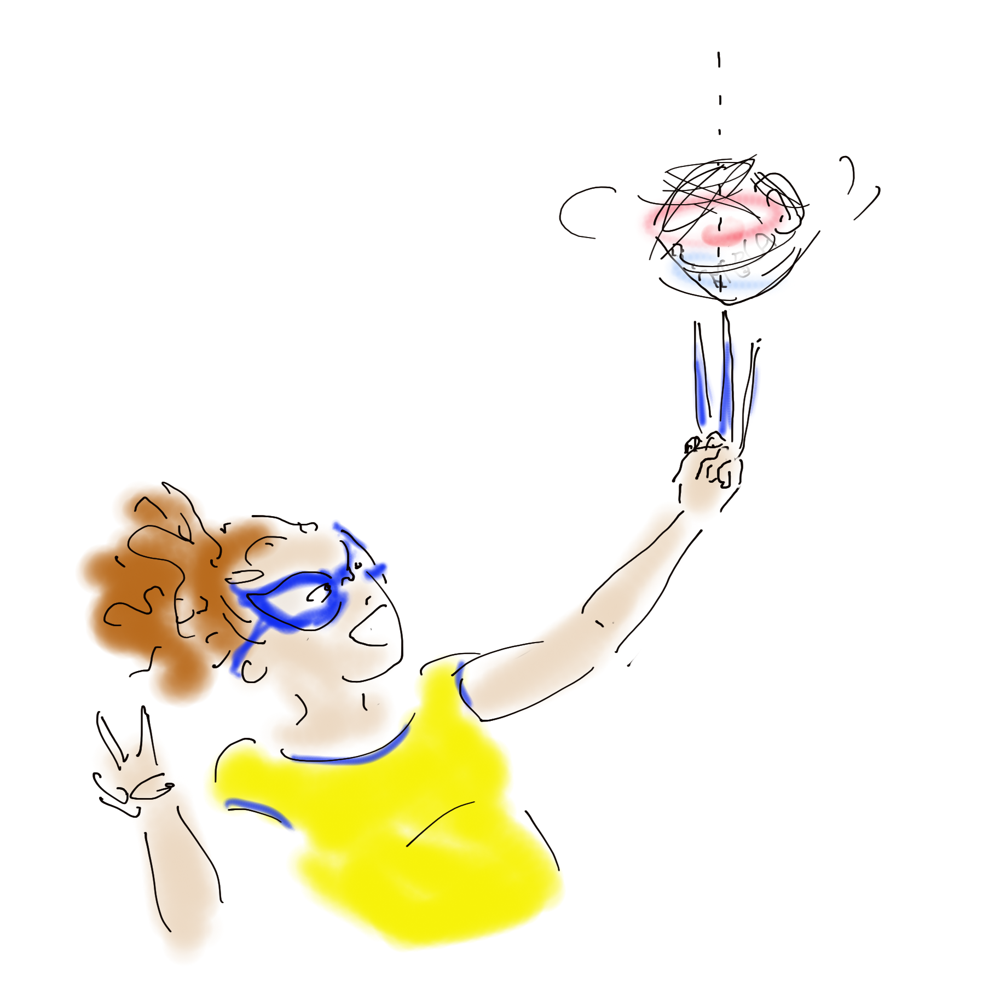
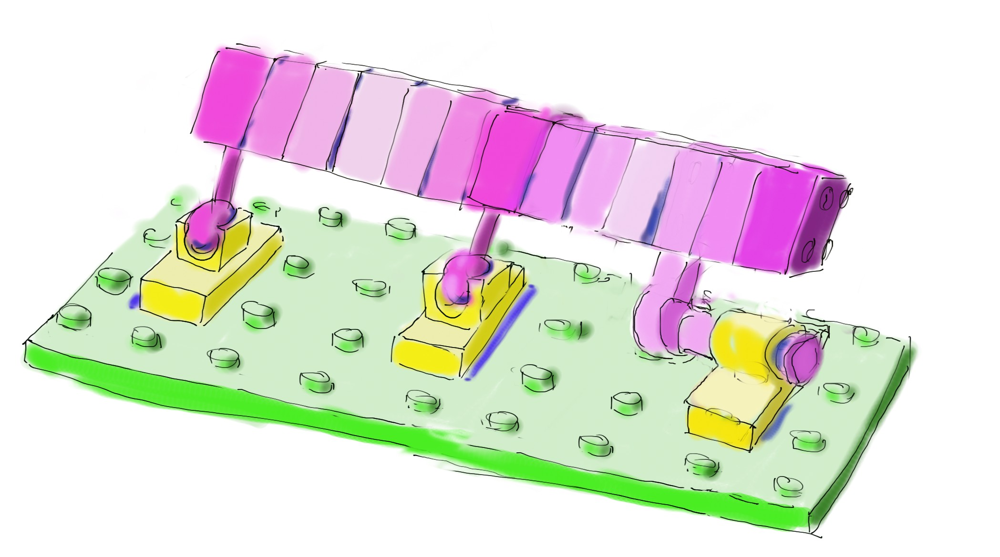

# index des fiches de facilitation graphique en Mécanique Générale (solides indéformables)
Dans cette section vous trouverez les fiches illustrant les concepts manipulés en mécanique générale. 

  <strong style="color: #856404; font-size: 14px;">⚠️ VERSION DE TRAVAIL</strong>
  
    Détail de la thématique en cours de construction.
  

   Vous pouvez proposer une nouvelle thématique ou vous exprimer en surlignant du texte et en cliquant sur 'annotate'/'public'

  <!-- Carte 1: propriétés inertielles -->
  

    

      Inerties
    

    

      
      

        Masse,
        Moment d'inertie,  
        Produit d'inertie,
        Centre de masse,
        Plans et axes de symétrie,
        Base principale, 
        Force centrifuge, 
        Huyggens,
        ...
        

      

        <a href="MG_inerties/MG_inerties0.html" class="card-link">
          j'y vais ! <i class="fas fa-arrow-right"></i>
        </a>
      

    

  

  <!-- Carte 2 : h -->
  

    

      Hyperstatisme
    

    

      
      

        Sens physique, 
        Critères de comparaison, 
        Assemblage de boucles, 
        Lien matriciel, 
        ...
        

      

        <a href="MG_hyperstatisme/MG_hyperstatisme0.html" class="card-link">
          j'y vais ! <i class="fas fa-arrow-right"></i>
        </a>
      

    

  

  <!-- Carte 3 : torseurs -->
  

    

      Torseurs
    

    

      
      

        Changement de point (Varignon), 
        Torseur cinématique, 
        Axe instantané de rotation,
        Torseur d'actions mécaniques, 
        Torseur cinétique
        Torseur Dynamique
        

      

        <a href="MG_torseurs/MG_Torseur_0.html" class="card-link">
          j'y vais ! <i class="fas fa-arrow-right"></i>
        </a>
      

    

  

  <!-- Carte 4 : matrices de rotation -->
  

    

      Matrice de rotation
    

    

      
      
 Rotation simple, 
          Rotation multiaxiale
          Changement de Base ...

      

        <a href="MG_rotation/MG_Rotation_0.html" class="card-link">
          Détail des sujets <i class="fas fa-arrow-right"></i>
        </a>
      

    

  

  <!-- Carte 5 : dérivée vectorielle -->
  

    

      Dérivée vectorielle
    

    

      
      
 Changement de norme, 
          Changement de direction,
          ...

      

        <a href="MG_dervectorielle/MG_der_vectorielles0.html" class="card-link">
          Détail des sujets <i class="fas fa-arrow-right"></i>
        </a>
      

    

  

  <!-- Carte 6 : Energie cinétique -->
  

    

      Energie cinétique
    

    

      
      
 Ec translation, 
          Ec rotation, 
          Ec mouvement couplé, 
          Comoment,
          Point d'application ...

      

        <a href="MG_Ec/MG_Ec_0.html" class="card-link">
          Détail des sujets <i class="fas fa-arrow-right"></i>
        </a>
      

    

  

  <!-- Carte n: you -->
  

    

      Vos demandes / besoins / Suggestions
    

    

      
      

        Texte,
        ...
        

      

        <a href="You/MG_You1.html" class="card-link">
          j'y vais ! <i class="fas fa-arrow-right"></i>
        </a>
      

    

  

## À propos de ce document

L'autrice principale de ces fiches est Emeline Faugere. 
Le travail se fait en collaboration avec les enseignant.es et élèves de l'ENS Paris-Saclay. 

