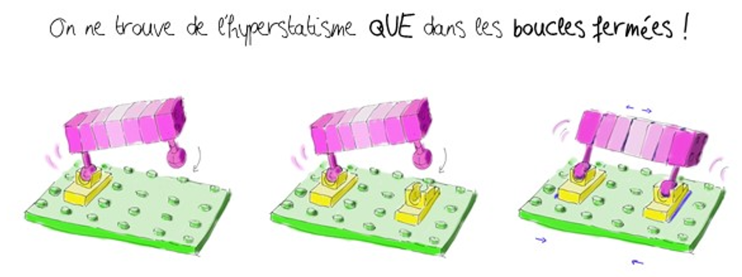
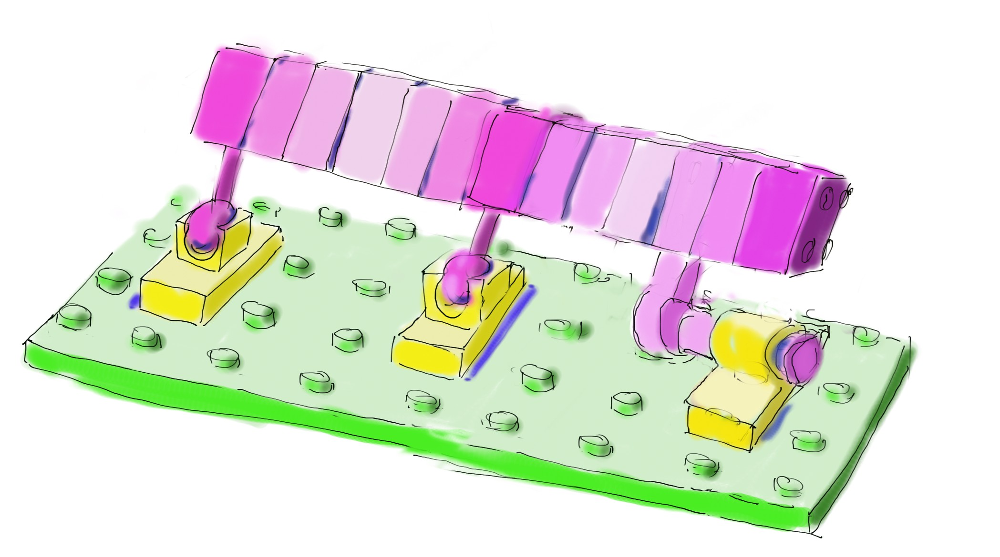
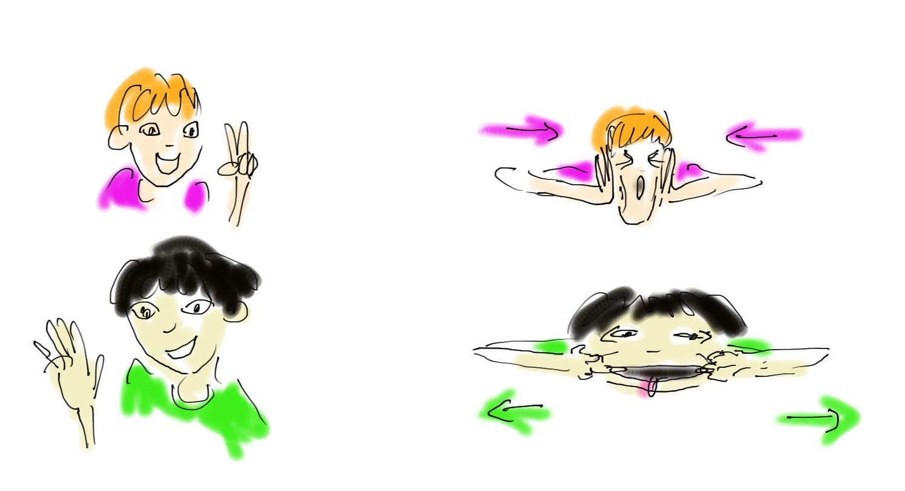

  <strong style="color: #856404; font-size: 14px;">⚠️ VERSION DE TRAVAIL</strong>
  
    Document en cours de développement à ne pas diffuser tel quel.
  

  💬 <strong>Améliorons ensemble la proposition !</strong> Surlignez du texte et cliquez sur "Annotate"

# MG hyperstatisme
Ahhh la formule magique... et les justification apprises par coeur, toi-même tu sais ;)

  <!-- Carte 1 -->
  

    

      h.1 : le sens physique
    

    

      
      
 calculer et identifier h SANS CALCUL 

      

        <a href="../MG_hyperstatisme/MG_hyperstatisme1.html" class="card-link">
          Voir la fiche <i class="fas fa-arrow-right"></i>
        </a>
      

    

  

  <!-- Carte 2 -->
  

    

      h.2 : comparer iso et hyper
    

    

      
      
 Justifier (ou choisir) de façon pertinente un système iso ou hyperstatique. Faire le lien avec la dimension des jeux et les modèles de liaisons 

      

        <a href="../MG_hyperstatisme/MG_hyperstatisme2.html" class="card-link">
          Voir la fiche <i class="fas fa-arrow-right"></i>
        </a>
      

    

  

  <!-- Carte 3 -->
  

    

      h.3 : boucles parallèles
    

    

      
      
 Localiser h. Gérer de façon physique le calcul de h. Identifier où lacher des contraintes de façon pertinente 

      

        <a href="../MG_hyperstatisme/MG_hyperstatisme3.html" class="card-link">
          Voir la fiche <i class="fas fa-arrow-right"></i>
        </a>
      

    

  

  <!-- Carte 4 -->
  

    

      h.4 : retrouver la formule sans fatigue
    

    

      
      
 En statique ou en cinématique. En se souvenant des deux méthodes. Comprendre les risques de singularité 

      

        <a href="../MG_hyperstatisme/MG_hyperstatisme4.html" class="card-link">
          Voir la fiche <i class="fas fa-arrow-right"></i>
        </a>
      

    

  

  <!-- Carte 5 -->
  

    

      h.5 : mu ou mi ?
    

    

      
      
 Distinguer mu et mi 

      

        <a href="../MG_hyperstatisme/MG_hyperstatisme5.html" class="card-link">
          Voir la fiche <i class="fas fa-arrow-right"></i>
        </a>
      

    

  

<!--
## h.1 : le sens physique
- calculer et identifier h SANS CALCUL  

## h.2 : comparer iso et hyper
- justifier (ou choisir) de façon pertinente un système iso ou hyperstatique
- faire le lien avec la dimension des jeux et les modèles de liaisons

## h.3 : boucles parallèles
- localiser h
- gérer de façon physique le calcul de h
- identifier où lacher des contraintes de façon pertinente 

## h.4 : retrouver la formule sans fatigue
- en statique ou en cinématique
- en se souvenant des deux méthodes
- comprendre les risques de singularité

## h.5 : mu ou mi ?
- distinguer mu et mi
-->
<!--
## Test affichage Page par page

iso-hyper le match

plusieurs boucles

mise en équation matricielle

mu mi

## Test affichage Deux pages par deux pages

iso-hyper le match

plusieurs boucles

mise en équation matricielle

mu mi

## Test affichage avec le pdf complet

<iframe src="../_static/pdfs/hyperstatisme_A4_2ppf.pdf" width="100%" height="600px"></iframe>

-->

