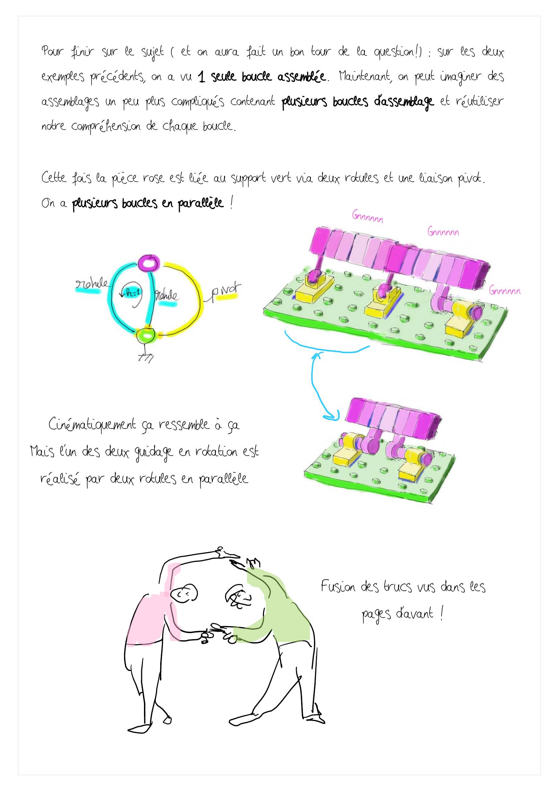
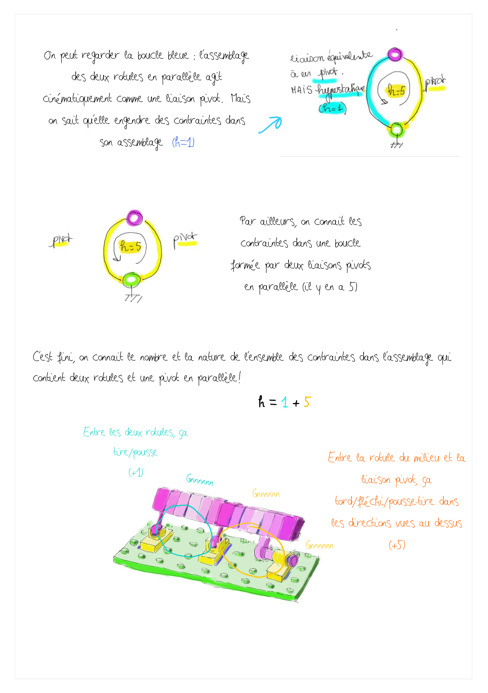

  <strong style="color: #856404; font-size: 14px;">⚠️ VERSION DE TRAVAIL</strong>
  
    Document en cours de développement à ne pas diffuser tel quel.
  

  💬 <strong>Améliorons ensemble la proposition !</strong> Surlignez du texte et cliquez sur "Annotate"

# h.3 - boucles parallèles
*Objectif de cette fiche : localiser h. Gérer de façon physique le calcul de h. Identifier où lacher des contraintes de façon pertinente *

   Surlignez ce texte pour commenter la page     👆       - 

   Surlignez ce texte pour commenter la page     👆       - 

<!--
## Test affichage Page par page

iso-hyper le match

plusieurs boucles

 Vos retours/besoins/demandes sont bienvenu.es! <mark style="background-color: #fbdaffff;"> <-- Clique sur un mot et commente !<mark> 

 Vos retours/besoins/demandes sont bienvenu.es! <mark style="background-color: #fbdaffff;"> <-- Clique sur un mot et commente !<mark> 

mise en équation matricielle

mu mi

## Test affichage Deux pages par deux pages

iso-hyper le match

plusieurs boucles

mise en équation matricielle

mu mi

## Test affichage avec le pdf complet

<iframe src="../_static/pdfs/hyperstatisme_A4_2ppf.pdf" width="100%" height="600px"></iframe>

-->

