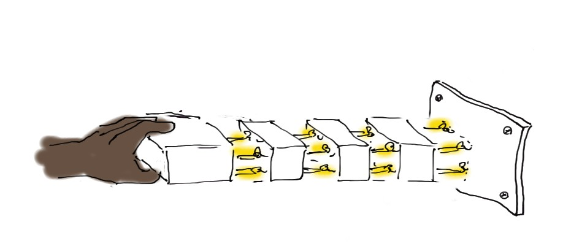
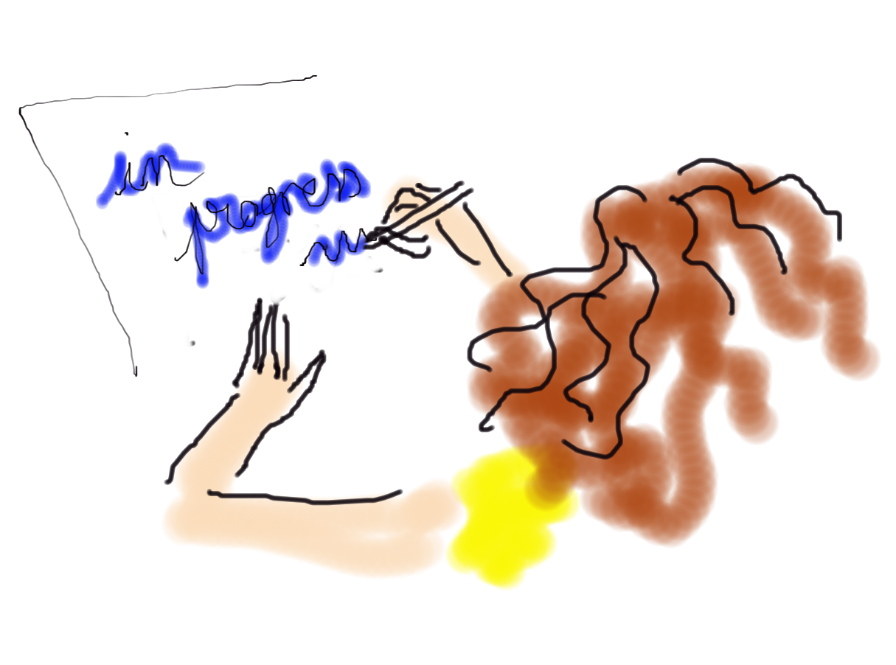

# index des fiches de facilitation graphique en MMC
Dans cette section vous trouverez les fiches illustrant les concepts manipulés en MMC (milieux solides déformables)

  <strong style="color: #856404; font-size: 14px;">⚠️ VERSION DE TRAVAIL</strong>
  
    Détail de la thématique en cours de construction.
  

   Vous pouvez proposer une nouvelle thématique ou vous exprimer en surlignant du texte et en cliquant sur 'annotate'/'public'

  <!-- Carte 1: ... -->
  

    

      Contraintes
    

    

      
      

        Vecteur contrainte, 
        Tenseur contraintes,
        Equilibre, 
        Symétrie du tenseur, 
        ...
        

      

        <a href="MMC_contraintes/MMC_vect_contrainte1.html" class="card-link">
          j'y vais ! <i class="fas fa-arrow-right"></i>
        </a>
      

    

  

  <!-- Carte 2: ... -->
  

    

      Déformations
    

    

      
      

        Vecteur déformation, 
        Tenseur déformations,
        TrE 
        Symétrie du tenseur, 
        ...
        

      

        <a href="MMC_Def/MMC_Def0.html" class="card-link">
          j'y vais ! <i class="fas fa-arrow-right"></i>
        </a>
      

    

  

  <!-- Carte n: ... -->
  

    

      Energie de déformation
    

    

      
      

        texte 
        ...
        

      

        <a href="MMC_Ed/MMC_Ed0.html" class="card-link">
          j'y vais ! <i class="fas fa-arrow-right"></i>
        </a>
      

    

  

  <!-- Carte n: RdC... -->
  

    

      Relations de comportement
    

    

      
      

        1D et 3D 
        ...
        

      

        <a href="MMC_Ed/MMC_RDC0.html" class="card-link">
          j'y vais ! <i class="fas fa-arrow-right"></i>
        </a>
      

    

  

  <!-- Carte n: you -->
  

    

      Vos demandes / besoins / Suggestions
    

    

      
      

        Texte,
        ...
        

      

        <a href="You/MMC_You1.html" class="card-link">
          j'y vais ! <i class="fas fa-arrow-right"></i>
        </a>
      

    

  

## À propos de ce document

L'autrice principale de ces fiches est Emeline Faugere. 
Le travail se fait en collaboration avec les enseignant.es et élèves de l'ENS Paris-Saclay. 

