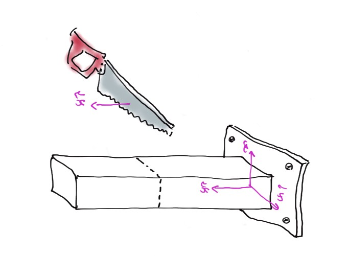
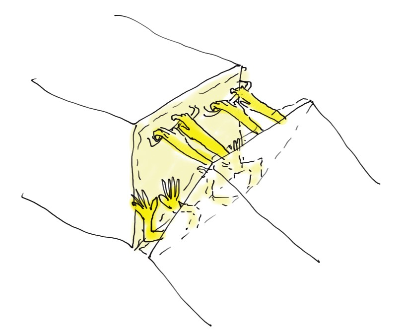
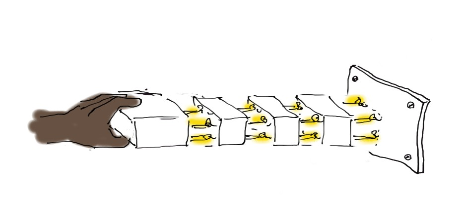
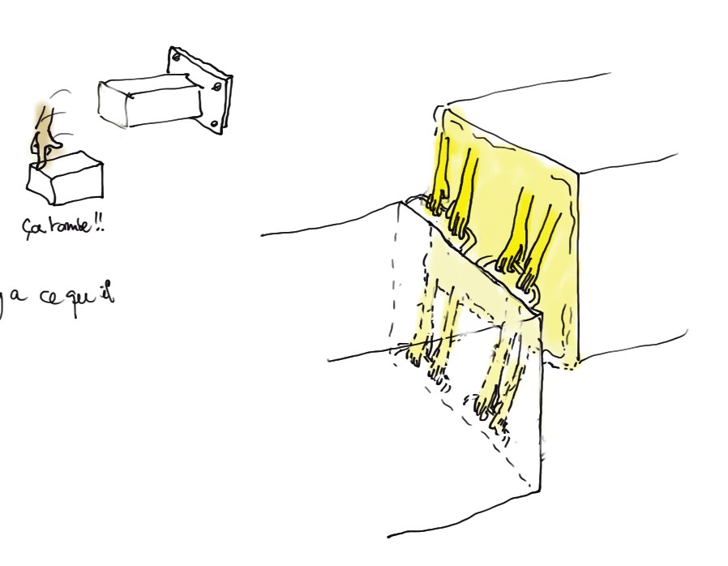
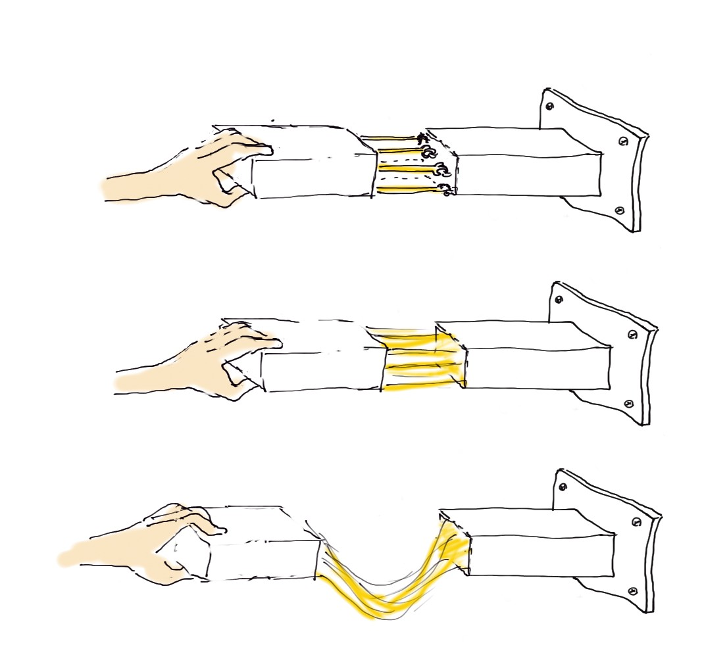
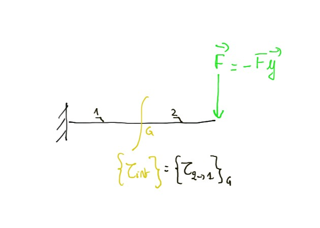

  <strong style="color: #856404; font-size: 14px;">⚠️ VERSION DE TRAVAIL</strong>
  
    Document en cours de développement à ne pas diffuser tel quel.
  

  💬 <strong>Améliorons ensemble la proposition !</strong> Surlignez du texte et cliquez sur "Annotate"

# MMC Contraintes
Comprendre physiquement ce qui se passe dans la matière pour écrire les composantes des tenseurs des contraintes au bon endroit, mettre correctement le problème en données et analyser les résultats de calculs en comprenant le sens physique.

  <!-- Carte 1 -->
  

    

      Cont.1 : Vecteur contrainte
    

    

      
      
 c'est juste un petit effort surfacique dans la matière. Comprendre cette notion de facette qui n'est rien d'autre que la tranche de découpage 

      

        <a href="../MMC_contraintes/MMC_vect_contrainte1.html" class="card-link">
          Voir la fiche <i class="fas fa-arrow-right"></i>
        </a>
      

    

  

  <!-- Carte 2 -->
  

    

      Cont.2 : Tenseur contrainte
    

    

      
      
 l'armoire à ranger les actinos mécaniques 3D sur chaque petit bout de matière 

      

        <a href="../MMC_contraintes/MMC_vect_contrainte2.html" class="card-link">
          Voir la fiche <i class="fas fa-arrow-right"></i>
        </a>
      

    

  

  <!-- Carte 3 -->
  

    

      Cont.3 : div sigma
    

    

      
      
 l'équilibre en résultante d'un petit bout de matière sous l'effet des AM appliquées. Comprendre ça c'est comprendre ce qu'on écrit dans le terme d'actions volumiques et dans le membre représentant la dynamique inertielle du petit bout 

      

        <a href="../MMC_contraintes/MMC_vect_contrainte3.html" class="card-link">
          Voir la fiche <i class="fas fa-arrow-right"></i>
        </a>
      

    

  

  <!-- Carte 4 -->
  

    

      Cont.4 : Symétrie du tenseur
    

    

      
      
 l'effet direct de l'équilibre en moment d'un petit bout de matière 

      

        <a href="../MMC_contraintes/MMC_vect_contrainte4.html" class="card-link">
          Voir la fiche <i class="fas fa-arrow-right"></i>
        </a>
      

    

  

  <!-- Carte 5 -->
  

    

      Cont.5 : Cisaillement
    

    

      
      
 physiquement les actions qui empêchent de glisser 

      

        <a href="../MMC_contraintes/MMC_vect_contrainte5.html" class="card-link">
          Voir la fiche <i class="fas fa-arrow-right"></i>
        </a>
      

    

  

  <!-- Carte 6 -->
  

    

      Cont.6 : tenseur cylindrique/cartésien
    

    

      
      
 se représenter les découpages de matière en part de tarte ou en poireaux/oignons pour comprendre physiquement les termes du tenseur exprimé dans une base cylindrique ou sphérique 

      

        <a href="../MMC_contraintes/MMC_vect_contrainte6.html" class="card-link">
          Voir la fiche <i class="fas fa-arrow-right"></i>
        </a>
      

    

  

  <!-- Carte 7 -->
  

    

      Cont.7 : Equilibre MMC -> RdM
    

    

      
      
 retrouver tout pareil les équations d'équilibre de la rdm 

      

        <a href="../MMC_contraintes/MMC_vect_contrainte7.html" class="card-link">
          Voir la fiche <i class="fas fa-arrow-right"></i>
        </a>
      

    

  

  <!-- Carte 8 -->
  

    

      Cont.8 : Base principale 
    

    

      
      
 comprendre physiquement ce que représente la base principale du tenseur des contrainte 

      

        <a href="../MMC_contraintes/MMC_vect_contrainte8.html" class="card-link">
          Voir la fiche <i class="fas fa-arrow-right"></i>
        </a>
      

    

  

  <!-- Carte 9 -->
  

    

      Cont.9 : Trace de sigma  
    

    

      
      
 variation de volume 

      

        <a href="../MMC_contraintes/MMC_vect_contrainte9.html" class="card-link">
          Voir la fiche <i class="fas fa-arrow-right"></i>
        </a>
      

    

  

