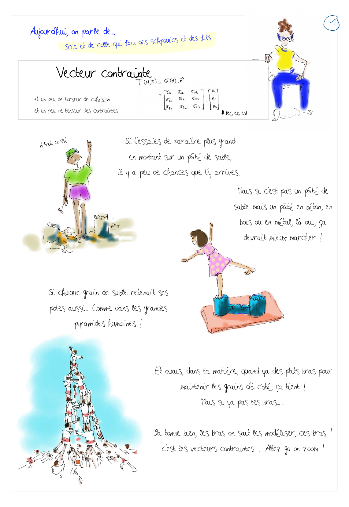
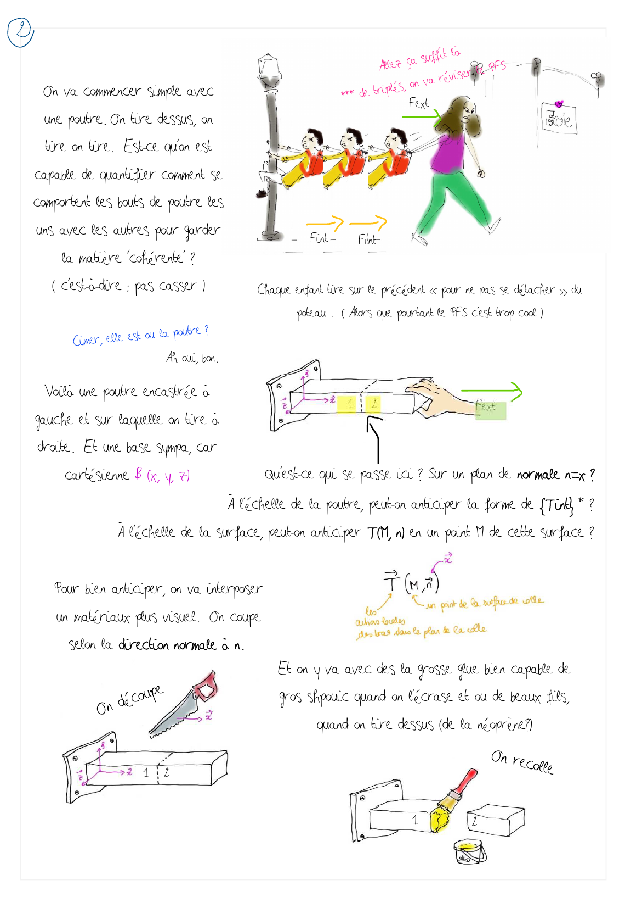
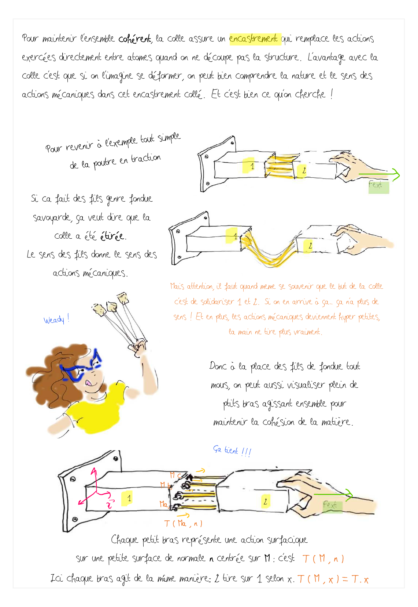
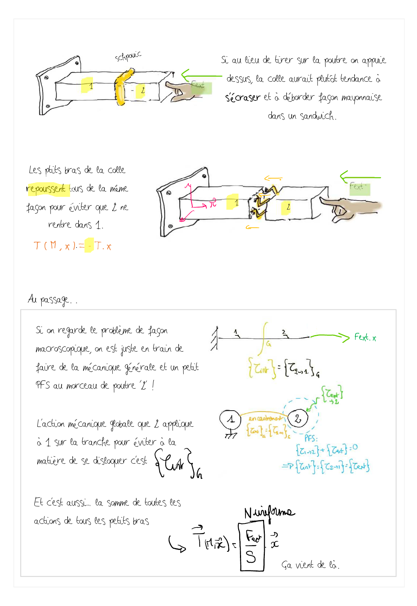
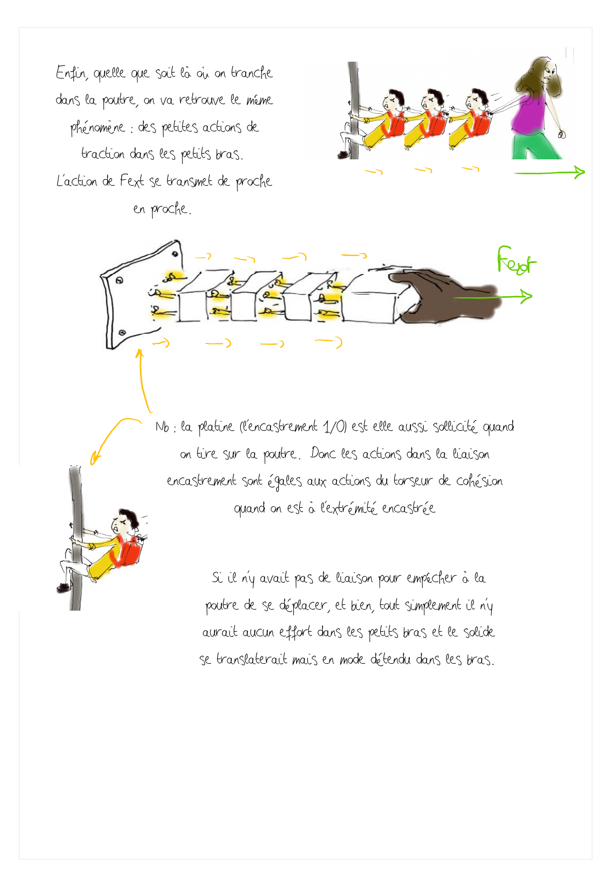
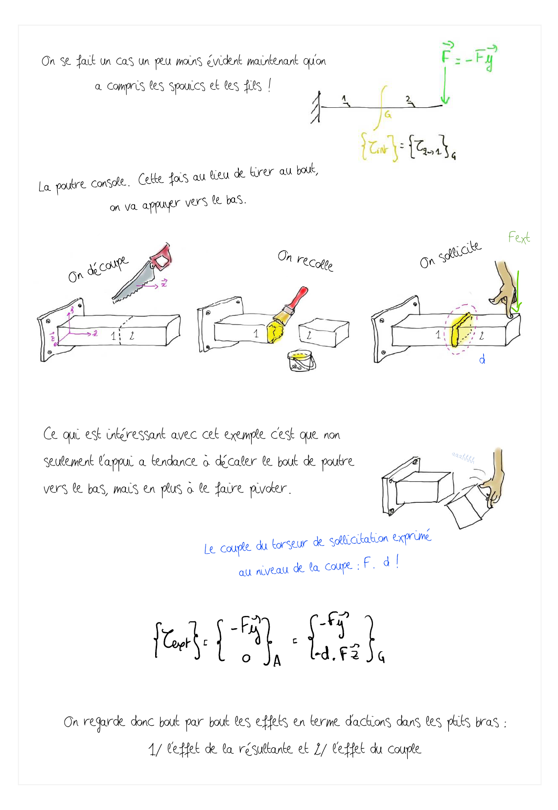

  <strong style="color: #856404; font-size: 14px;">⚠️ VERSION DE TRAVAIL</strong>
  
    Document en cours de développement à ne pas diffuser tel quel.
  

  💬 <strong>Améliorons ensemble la proposition !</strong> Surlignez du texte et cliquez sur "Annotate"

# cont.1 : Vecteur contrainte
*Objectif de cette fiche : c'est juste un petit effort surfacique dans la matière. Comprendre cette notion de facette qui n'est rien d'autre que la tranche de découpage*

   Surlignez ce texte pour commenter la page     👆       - 

   Surlignez ce texte pour commenter la page     👆       - 

   Surlignez ce texte pour commenter la page     👆       - 

   Surlignez ce texte pour commenter la page     👆       - 

   Surlignez ce texte pour commenter la page     👆       - 

   Surlignez ce texte pour commenter la page     👆       - 

<!--
## Test affichage Page par page

## Test affichage Deux pages par deux pages

## Test affichage avec le pdf complet

<iframe src="../_static/pdfs/vecteur_contrainte_A4_2ppf.pdf" width="100%" height="600px"></iframe>

-->