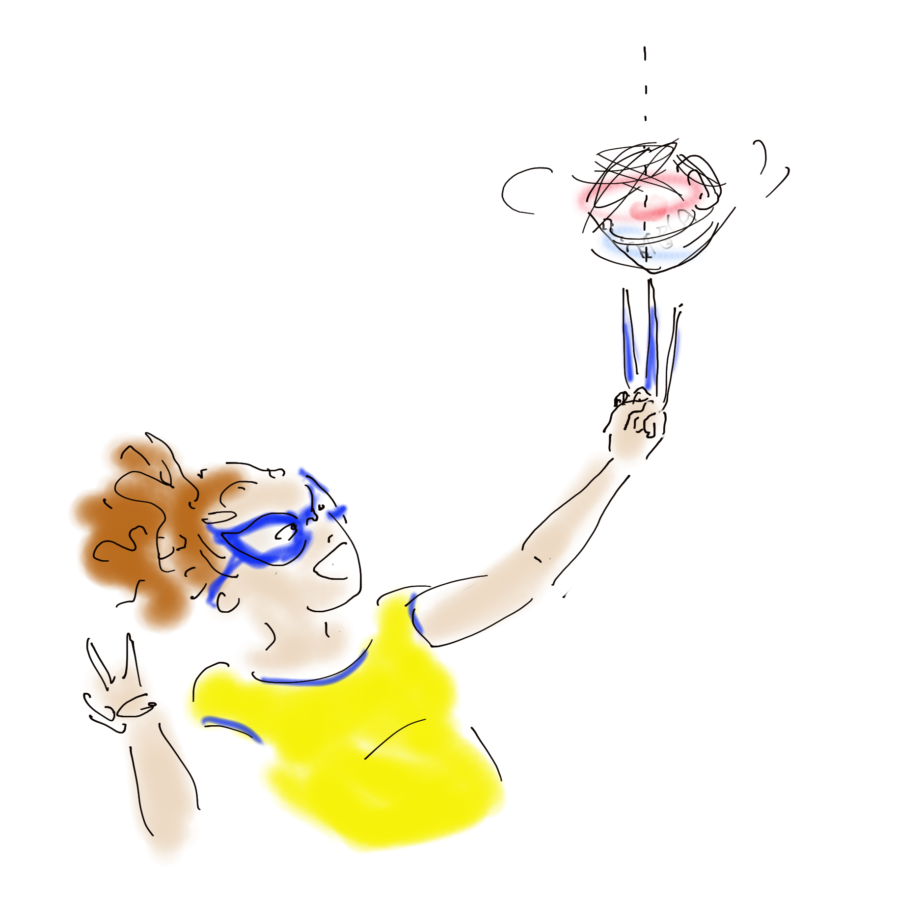

# index des fiches de facilitation graphique en ...
Dans cette section vous trouverez les fiches illustrant les concepts manipulés en ... 

   Vous pouvez proposer une nouvelle thématique ou vous exprimer en surlignant du texte et en cliquant sur 'annotate'/'public'

  <!-- Carte 1: ... -->
  

    

      Inerties
    

    

      
      

        Texte,
        ...
        

      

        <a href="MG_inerties/MG_inerties1.html" class="card-link">
          j'y vais ! <i class="fas fa-arrow-right"></i>
        </a>
      

    

  

## À propos de ce document

L'autrice principale de ces fiches est Emeline Faugere. 
Le travail se fait en collaboration avec les enseignant.es et élèves de l'ENS Paris-Saclay. 

