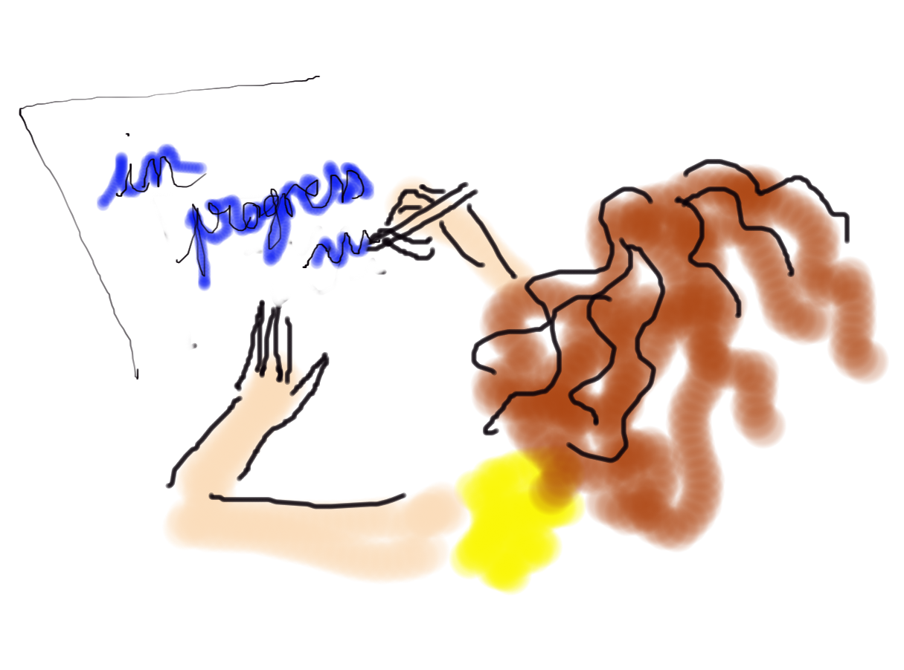

# index des fiches de facilitation graphique en Vibrations
Dans cette section vous trouverez les fiches illustrant les concepts manipulés en Vibrations

  <strong style="color: #856404; font-size: 14px;">⚠️ VERSION DE TRAVAIL</strong>
  
    Détail de la thématique en cours de construction.
  

   Vous pouvez proposer une nouvelle thématique ou vous exprimer en surlignant du texte et en cliquant sur 'annotate'/'public'

  <!-- Carte 1: ... -->
  

    

      VIB 1ddl
    

    

      
      

        Texte,
        ...
        

      

        <a href="VIB_1ddl/VIB_1ddl_0.html" class="card-link">
          j'y vais ! <i class="fas fa-arrow-right"></i>
        </a>
      

    

  

  <!-- Carte 1: ... -->
  

    

      VIB reyleigh
    

    

      
      

        Texte,
        ...
        

      

        <a href="VIB_Reyleigh/VIB_Reyleigh_0.html" class="card-link">
          j'y vais ! <i class="fas fa-arrow-right"></i>
        </a>
      

    

  

  <!-- Carte 1: ... -->
  

    

      VIB translation_rotation
    

    

      
      

        Texte,
        ...
        

      

        <a href="VIB_translation_rotation/VIB_translation_rotation_0.html" class="card-link">
          j'y vais ! <i class="fas fa-arrow-right"></i>
        </a>
      

    

  

  <!-- Carte 1: ... -->
  

    

      VIB sujet 1 (à définir)
    

    

      
      

        Texte,
        ...
        

      

        <a href="VIB_sujet1/VIB_sujet1_0.html" class="card-link">
          j'y vais ! <i class="fas fa-arrow-right"></i>
        </a>
      

    

  

  <!-- Carte 2: ... -->
  

    

      VIB sujet 2 (à définir)
    

    

      
      

        Texte,
        ...
        

      

        <a href="VIB_sujet2/VIB_sujet2_0.html" class="card-link">
          j'y vais ! <i class="fas fa-arrow-right"></i>
        </a>
      

    

  

  <!-- Carte n: ... -->
  

    

      VIB sujet n (à définir)
    

    

      
      

        Texte,
        ...
        

      

        <a href="VIB_sujetn/VIB_sujetn_0.html" class="card-link">
          j'y vais ! <i class="fas fa-arrow-right"></i>
        </a>
      

    

  

  <!-- Carte n: you -->
  

    

      Vos demandes / besoins / Suggestions
    

    

      
      

        Texte,
        ...
        

      

        <a href="You/VIB_You1.html" class="card-link">
          j'y vais ! <i class="fas fa-arrow-right"></i>
        </a>
      

    

  

## À propos de ce document

L'autrice principale de ces fiches est Emeline Faugere. 
Le travail se fait en collaboration avec les enseignant.es et élèves de l'ENS Paris-Saclay. 

